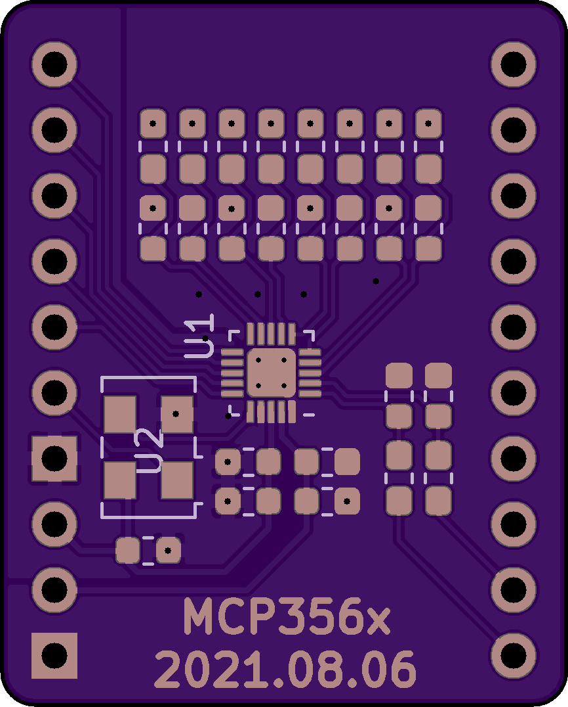
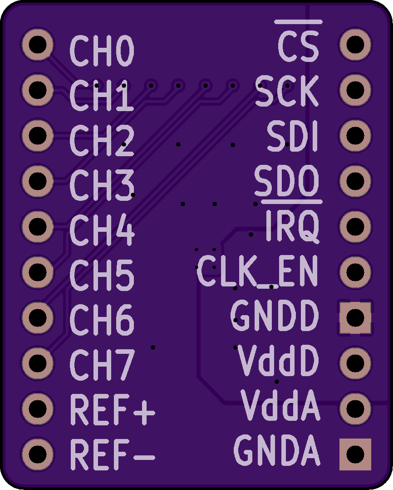
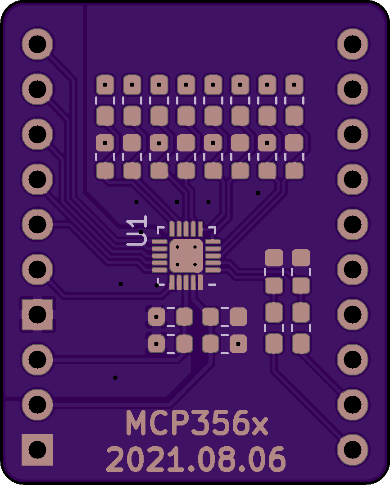
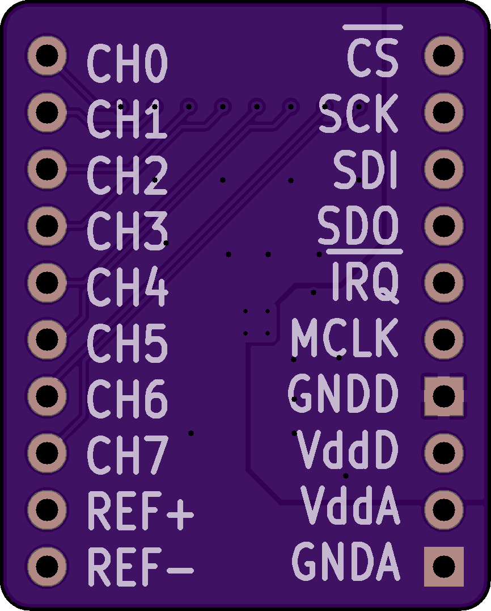

# MCP3564-Breakout

A breakout board for Microchip's 24-bit SPI ADC. The MCP3564 is a 24-bit sigma-delta ADC with support for up to eight single-ended, or four differential channels. It supports extensive oversampling depths, flexible MUX front-end, circuit burnout detection, adjustable gain, Vref from [0v - 3.6v], and optional internal oscillator.

#### [Hackaday.io Page](https://hackaday.io/project/168371-mcp3564-breakout)

#### [Order from Tindie](https://www.tindie.com/products/24263/)

------------------------

### What is in this repository:

**./doc**:  Location for documentation

**./KiCAD**:  Hardware design files

**./Arduino**:  Arduino driver

------------------------

Front (With OSC) | Back (With OSC)
:-------:|:------:
  | 
Front (No OSC) | Back (No OSC)
  | 

